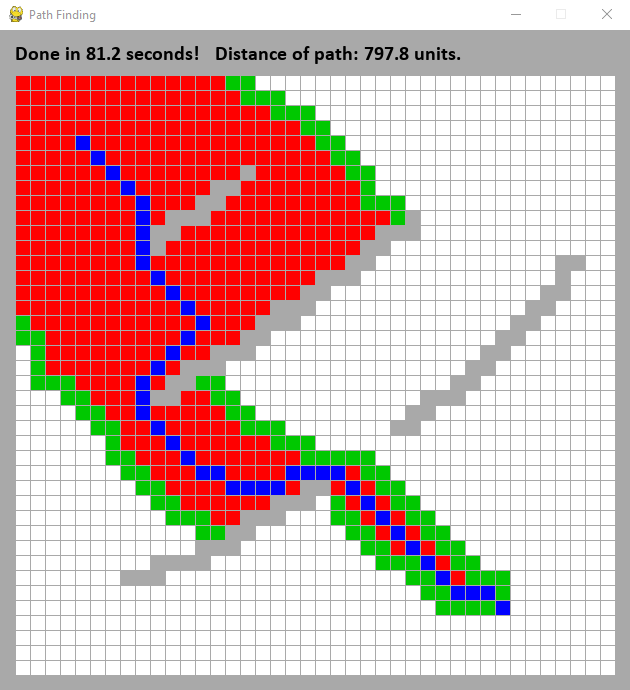

# path_finding

Path finding algorithm

@gontluc march 2022

Main file: **path_finding.py**

 

 

---

OBJECTIVE: Build a path finding using A* (astar) search algorithm and visualize it in a GUI.

---

 

Uses pygame module.

 

---

VISUALIZE: Run and follow instructions. Q to quit at anytime.

---

 

OBSERVATIONS:

* [A* (astar) search algorithm](https://en.wikipedia.org/wiki/A*_search_algorithm) consists of finding the shortest path from A to B, with obstacles in between.

* Could implement binary search to make it faster.
